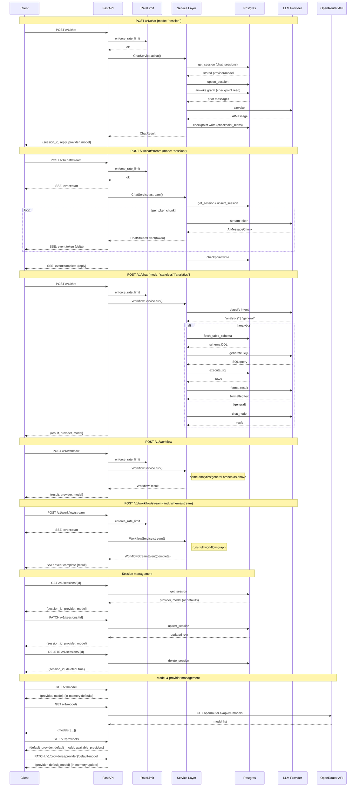

# API Sequence Diagram

## Endpoint Reference

| Endpoint | Persistence | Streaming | Graph |
|---|---|---|---|
| `POST /v1/chat` (session) | Postgres checkpoint + chat_sessions | No | chat.py |
| `POST /v1/chat/stream` (session) | Postgres checkpoint + chat_sessions | SSE tokens | chat.py |
| `POST /v1/chat` (stateless/analytics) | None | No | workflow.py |
| `POST /v1/workflow` | None | No | workflow.py |
| `POST /v1/workflow/stream` | None | SSE start+complete | workflow.py |
| `POST /v1/workflow/schema/stream` | None | SSE start+complete | workflow.py (logistics-schema default) |
| `GET/PATCH/DELETE /v1/sessions/{id}` | chat_sessions table | — | — |
| `GET /v1/model`, `GET /v1/providers` | In-memory | — | — |
| `PATCH /v1/providers/{p}/default-model` | In-memory (resets on restart) | — | — |
| `GET /v1/models` | Proxies OpenRouter API | — | — |
